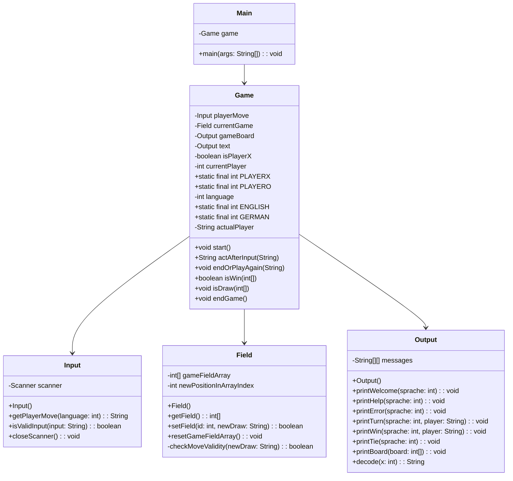

```mermaid
classDiagram
    class Main {
        -Game game
        +main(args: String[]): void
    }

    class Game {
        -Input playerMove
        -Field currentGame
        -Output gameBoard
        -Output text
        -boolean isPlayerX
        -int currentPlayer
        +static final int PLAYERX
        +static final int PLAYERO
        -int language
        +static final int ENGLISH
        +static final int GERMAN
        -String actualPlayer

        +void start()
        +String actAfterInput(String)
        +void endOrPlayAgain(String)
        +boolean isWin(int[])
        +void isDraw(int[])
        +void endGame()
    }

    class Input {
        -Scanner scanner
        +Input()
        +getPlayerMove(language: int): String
        +isValidInput(input: String): boolean
        +closeScanner(): void
    }
    
    class Output {
        -String[][] messages
        +Output()
        +printWelcome(sprache: int): void
        +printHelp(sprache: int): void
        +printError(sprache: int): void
        +printTurn(sprache: int, player: String): void
        +printWin(sprache: int, player: String): void
        +printTie(sprache: int): void
        +printBoard(board: int[]): void
        +decode(x: int): String
    }

    class Field {
        -int[] gameFieldArray
        -int newPositionInArrayIndex
        +Field()
        +getField(): int[]
        +setField(id: int, newDraw: String): boolean
        +resetGameFieldArray(): void
        -checkMoveValidity(newDraw: String): boolean
    }

    Main --> Game
    Game --> Input
    Game --> Field
    Game --> Output

```
