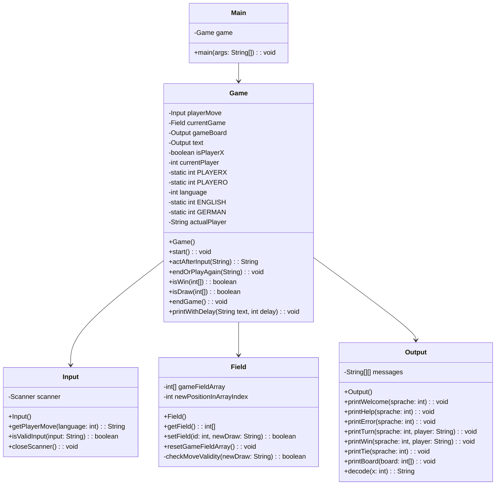

# Tic-Tac-Toe Game in Java

This is a simple command-line Tic-Tac-Toe game implemented in Java. The game allows two players to take turns marking the cells in a 3x3 grid with 'X' and 'O' symbols, and the first player to get three of their symbols in a row, column, or diagonal wins the game.

Link to class diagram : https://miro.com/app/board/uXjVNexzcj8=/?share_link_id=341104010035

## Classes

### Game

#### Purpose of Class:
The `Game` class is the heart of the project. It creates new game objects and coordinates methods of the other classes. It is responsible for checking whether someone has won, ending or restarting the game, changing the language and determining if the current player is 'X' or 'O'.

### Output

#### Purpose of Class:
The `Output` class takes care of printing the game board and the text that belongs to it, as well as translation functionalities. This class has an 2D Array where messages in both languages are stored and returned, according to the input. Each message has a method associated with it that can be called to print said message. `printBoard(int[])` prints the curent game board passed to it as an argument after it goes through the `decode(int)` method which translates it to the desired symbols It ensures a user-friendly interface for players.

### Field

#### Purpose of Class:
The `Field` class creates the array for the game board. The array initializes with 0 for an empty field, and it gets filled with 1s and 2s with each move. The class also checks if a move is set on an already used field.

### Input

#### Purpose of Class:
The `Input` class handles user input. It displays the current player ('X' or 'O'), checks the validity of the input, and prompts the user again if the input is not fulfilled. It provides other command options, such as restarting the game (0), quitting (999), changing languages (S), and getting help (h).

### Test classes

`GameTest`
Description: The test cases check if the `isWin` and `isDraw`methods in the Game class correctly identifiy if the field is a win/draw situation or not.
`testIsWin`: This test case checks if the `isWin` method correctly identifies a win condition on the game board.
Expected Result: The result should be `true` when a win condition is detected.
`testIsWinNoWin`: This test case checks if the isWin method correctly identifies when there is no win condition on the game board.
Expected Result: The result should be `false` when no win condition is detected.
`testIsDraw`: This test case checks if the `isDraw` method correctly identifies a draw condition on the game board.
Expected Result: The result should be `true` when a draw condition is detected.
`testIsNotDraw`: This test case checks if the isWin method correctly identifies when there is no draw condition.
Expected Result: The result should be `false` when no win condition is detected.

`FieldTest` validates the functionality of the `Field` class, ensuring moves and game field initializations are handled correctly.

`OutputTest` contains JUnit test cases to verify the functionality of the `Output` class.
   Test Cases:
    The class includes multiple test methods, each testing a specific aspect of the `Output` class.
    - Test methods include:
    - `testPrintError`: Checks the `messages` array to ensure the correct error message is given.
    - `testPrintTie`: Checks the `messages` array to ensure the correct tie message is given.
    - `testPrintBoardRandom`: Verifies the `printBoard` method with a at random chosen game board.
    - Additional test methods for various game board configurations:
    - `testPrintBoardAllEmpty`
    - `testPrintBoardAllO`
    - `testPrintBoardAllX`
    - `testPrintBoardDiagX`
    - `testPrintBoardVerticalO`
    
`InputTest` This class contains test cases for the Input class to validate user inputs such as `InputTest`

